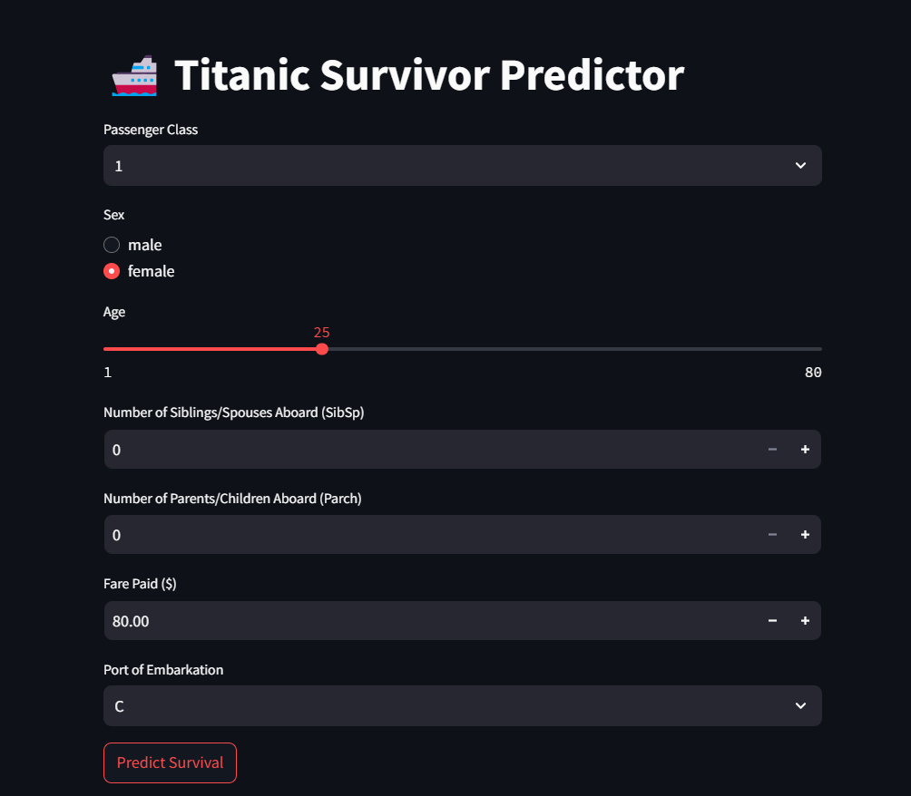

# 🚢 Titanic Survivor Predictor

An interactive web app that predicts whether a Titanic passenger would have survived based on their details using a trained Random Forest model.

Built using **Streamlit** and **Scikit-learn**.

---

## 🎯 Features

- Input passenger details like class, age, gender, fare, etc.
- Predict survival based on a trained ML model
- Visualize model confidence (probability)
- View feature importance influencing predictions
- Dark mode-friendly responsive UI
- Deployable online with **Streamlit Cloud**

---

## 🧠 Model Details

- Model: `RandomForestClassifier`
- Dataset: [Kaggle Titanic Dataset](https://www.kaggle.com/competitions/titanic/data)
- Accuracy: ~80%
- Features used:
  - Pclass, Sex, Age, SibSp, Parch, Fare
  - Embarked (one-hot encoded)
  - FamilySize (engineered feature)

---

## 🖥️ Live Demo

👉 [Click here to try the app](https://your-app-name.streamlit.app)

---

## 📸 Screenshots

| Input Form | Prediction Result |
|------------|-------------------|
|  |  |

---

## 🚀 Run Locally

### 1. Clone this repo
```bash
git clone https://github.com/yourusername/titanic-survivor-predictor.git
cd titanic-survivor-predictor

pip install -r requirements.txt

streamlit run app.py